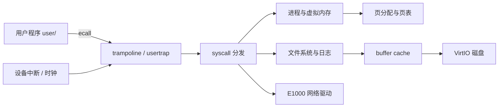

# xv6-riscv 架构速览

## 1. 总体调用关系

## 2. 用户态到内核态

用户程序链接 `user/usys.S` 中的短 stub。stub 把系统调用号放入 `a7` 并执行 `ecall`。RISC-V 保存异常原因和返回地址后转入 trampoline；`usertrap()` 识别系统调用，`syscall()` 用 `a7` 索引分发表，具体 `sys_*` 函数读取参数并调用内核子系统。返回时 `usertrapret()` 和 trampoline 恢复 trapframe，执行 `sret` 回到用户态。

## 3. 进程与地址空间

每个 `struct proc` 拥有状态、内核栈、用户页表、trapframe、文件表和 cwd。`fork()` 创建子进程并复制或共享地址空间；`exec()` 用 ELF 构造新页表后原子替换旧地址空间；`wait()` 回收僵尸子进程。

Sv39 把虚拟地址拆成三级 9 位索引和 12 位页内偏移。PTE 保存物理页号和 V/R/W/X/U/A 等标志。COW 与 mmap 都利用页故障延迟物理资源分配，但前者延迟复制匿名页，后者延迟载入文件页。

## 4. Trap、调度与并发

Trap 是控制权进入内核的统一机制，包含同步 exception（如 ecall/page fault）和异步 interrupt（如时钟/设备）。时钟中断可触发 `yield()`，scheduler 在 RUNNABLE 进程间切换 context。

多核共享状态通过 spinlock 或 sleeplock 保护。短、不可睡眠的内核临界区使用 spinlock；磁盘 buffer 等可能等待 I/O 的对象使用 sleeplock。Lock Lab 将全局热点拆为 per-CPU freelist 与哈希桶 cache，降低 test-and-set 争用。

## 5. 文件系统与网络

文件路径经目录项解析为 inode。inode 的直接、一级间接和双重间接地址定位数据块；日志把多个元数据修改包装成事务。buffer cache 同时提供磁盘块缓存与块级同步。

E1000 驱动通过 TX/RX descriptor ring 与设备交换 DMA buffer。发送方填描述符并推进 tail；接收方检查 DD 位、把 packet 交给网络栈并补充新 buffer。

## 6. 十个实验覆盖面

| 子系统 | 对应实验 |
| --- | --- |
| 用户程序、进程与管道 | util、thread |
| 系统调用与 trap | syscall、traps |
| 页表与内存生命周期 | pgtbl、cow、mmap |
| 设备与网络 | net |
| 多核同步与性能 | lock |
| inode、日志与路径 | fs |

