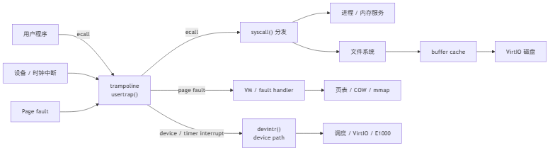

# 基于 xv6-riscv 的操作系统课程设计报告

## 封面信息

| 项目 | 内容 |
| --- | --- |
| 学校 | 同济大学 |
| 学院 | 计算机科学与技术学院 |
| 专业 | 软件工程 |
| 课程名称 | 操作系统课程设计 |
| 项目题目 | 基于 MIT 6.S081 Fall 2021 xv6-riscv 的操作系统实验与实现 |
| 学生姓名 | 祝宸旭 |
| 学号 | 2451770 |
| 项目形式 | 个人项目 |

## 摘要

本项目基于 MIT 6.S081 Fall 2021 的官方 `xv6-labs-2021`，完成 Utilities、System Calls、Page Tables、Traps、Copy-on-Write、Multithreading、Network Driver、Lock、File System 和 mmap 共 10 个实验。实现范围从 xv6 用户程序和系统调用入口延伸到 Sv39 页表、RISC-V trap、物理页引用计数、用户线程、E1000 网卡、并发数据结构、inode 块索引和文件映射。项目在 Windows 11 宿主机的 WSL2 Ubuntu 环境中使用 RISC-V GCC 与 QEMU 编译运行；10 个实验分支的官方 grader 总成绩为 `846/846`。报告重点分析 COW 与 mmap 中跨页表、trap、文件和进程生命周期的不变量。

**关键词：** xv6-riscv；系统调用；Sv39；Trap；Copy-on-Write；文件系统；mmap

## 1. 项目概述

xv6 是对 Unix Version 6 思想的教学性重实现，代码量较小，但具有进程、虚拟内存、系统调用、文件系统、设备驱动和多核同步等完整主干。RISC-V 的 privilege mode、异常寄存器和调用约定较清晰，适合从用户指令开始跟踪到内核数据结构和硬件接口。

项目按 MIT 6.S081 Fall 2021 的十个 RISC-V 实验分支组织。每个实验保留独立实现提交、初始测试记录、正式评分和细化报告，使实验过程、技术改动和测试结果能够逐项对应。

## 2. 项目工作量与完成情况

### 2.1 完成范围

项目完成 MIT 6.S081 Fall 2021 xv6-riscv 的 10/10 Labs，覆盖以下层次：

- 用户程序：进程、管道、目录和参数处理；
- 系统调用：用户 stub、`ecall`、trap、分发表和用户指针；
- 页表：Sv39、PTE 权限、访问位和特殊共享页；
- Trap：调用栈、时钟中断、用户上下文保存与恢复；
- COW：共享页、写故障、引用计数和 `copyout`；
- 多线程：RISC-V 用户上下文切换、mutex 和 condition variable；
- 网络驱动：E1000 descriptor ring、DMA 和 mbuf 所有权；
- 锁：per-CPU allocator、哈希 buffer cache 和争用控制；
- 文件系统：双重间接块、日志和符号链接；
- mmap：VMA、lazy fault、共享回写和进程生命周期。

### 2.2 完成成绩

| Lab | Topic | Grade | Status |
| --- | --- | ---: | --- |
| util | Utilities | 100/100 | Completed |
| syscall | System Calls | 35/35 | Completed |
| pgtbl | Page Tables | 46/46 | Completed |
| traps | Traps | 85/85 | Completed |
| cow | Copy-on-Write | 110/110 | Completed |
| thread | Multithreading | 60/60 | Completed |
| net | Network Driver | 100/100 | Completed |
| lock | Lock | 70/70 | Completed |
| fs | File System | 100/100 | Completed |
| mmap | mmap | 140/140 | Completed |
| **Total** | **10/10 Labs** | **846/846** | **Completed** |

十个实验分支覆盖课程规定的全部实验内容，对应课程说明中“完成全部实验内容”的 A 级工作量描述。各分支均有对应实现和官方 grader 结果，形成从用户程序到内核核心机制的完整实验序列。

## 3. 实验环境与复现边界

| 项目 | 实际环境 |
| --- | --- |
| 宿主 | Windows 11 build 22631.6199 |
| WSL | 2.7.11.0，内核 6.18.33.2 |
| Ubuntu | 26.04 LTS，`ext4.vhdx` 位于 `E:\WSL\Ubuntu` |
| QEMU | 10.2.1 |
| RISC-V GCC | 15.2.0 |
| Binutils | 2.46 |
| GDB multiarch | 17.1 |
| Make / Git | 4.4.1 / 2.53.0 |

实际运行关系为“Windows host → WSL2 Ubuntu → RISC-V cross toolchain + QEMU → xv6-riscv”，不是 xv6 直接运行在 Windows。GCC 15 环境中显式固定 `-march=rv64gc`，并对上游代码的新诊断做兼容处理；Python 3.14 环境安装 `pipes` 兼容包，以保证课程评分脚本正常运行。精确版本、安装位置和冷启动记录见 [docs/environment.md](environment.md) 与 `results/environment/final-cold-boot.txt`。

## 4. xv6 总体架构



*图 4-1 xv6 用户态、Trap 与内核子系统调用关系*

### 4.1 用户态、系统调用与 Trap

用户程序运行在 user mode，内核运行在 supervisor mode。用户 stub 将系统调用号写入 `a7` 并执行 `ecall`；trampoline 把用户寄存器保存到 `trapframe`，`usertrap()` 判断 trap 原因，`syscall()` 再按编号调用处理函数。系统调用返回值写入 trapframe 的 `a0`，`usertrapret()` 和 trampoline 恢复用户现场。

### 4.2 进程与调度

`allocproc()` 分配进程结构、trapframe 和页表；`fork()` 建立子进程；`exec()` 从 ELF 重建地址空间；`exit()` 释放资源并进入 ZOMBIE；`wait()` 完成最终回收。每 CPU scheduler 扫描 RUNNABLE 进程，`swtch()` 保存内核上下文中的 `ra/sp/s0-s11`。

### 4.3 虚拟内存

Sv39 使用三级页表和 4 KiB 页面。`walk()` 查找 PTE，`mappages()` 建立映射。Page Tables Lab 直接操作特殊映射和 `PTE_A`；COW 通过只读共享页和引用计数推迟 fork 复制；mmap 通过 VMA 和 page fault 推迟文件页装入。

### 4.4 并发、文件系统与设备

spinlock 保护短临界区，sleeplock 保护可能睡眠的长期操作。文件名经目录项解析为 inode，buffer cache 缓存磁盘块，日志保证多块更新的崩溃一致性。VirtIO 提供磁盘，E1000 通过 DMA descriptor ring 收发网络包。总体调用与 Trap 分流关系如图 4-1 所示，项目仓库中的 [docs/architecture.md](architecture.md) 提供进一步的组件说明。

## 5. Lab 01：Utilities

### 5.1 实验目的与要求

实现 `sleep`、`pingpong`、`primes`、`find` 和 `xargs`，掌握 xv6 用户程序构建、`fork/exec/wait`、pipe、文件描述符和目录项格式。

### 5.2 实验过程与关键实现

在 `user/sleep.c`、`pingpong.c`、`primes.c`、`find.c`、`xargs.c` 中分别实现五个程序，并加入 Makefile 的 `UPROGS`。`primes:sieve()` 为每个素数创建一级过滤进程；`find:find()` 读取 `struct dirent` 并递归；`xargs:run_line()` 组装 `char *args[MAXARG]` 后 fork/exec。

### 5.3 关键难点与解决

pipe 的 EOF 只有在所有写端关闭后出现，因此 fork 后每个进程立即关闭无用 fd；`find` 给固定长度名称补 `\0`，跳过 `.`/`..` 并检查路径长度；`xargs` 同时限制输入行长度和 `MAXARG`。

### 5.4 测试结果与分析

基线因程序不存在为 0/100；正式 `results/util/grade.txt` 中五项功能、time 均为 OK，最终 100/100。结果说明进程流水线能正常传播 EOF、递归目录不会形成环、各程序可共同进入 `fs.img`。

### 5.5 实验心得

这一实验的关键不是单个算法，而是 Unix 资源生命周期：错误保留一个 pipe 写端就足以让正确的筛选逻辑永久阻塞。详细记录见 `docs/labs/01-util.md`。

## 6. Lab 02：System Calls

### 6.1 实验目的与要求

实现 `trace(mask)` 和 `sysinfo(info)`，理解从 `user/usys.pl` 生成的 stub、`ecall`、trapframe 到 `kernel/syscall.c` 分派和具体 handler 的完整路径。

### 6.2 实验过程与关键实现

在 `kernel/syscall.h` 分配编号，在 `user/user.h` 与 `user/usys.pl` 添加接口，在 `kernel/sysproc.c` 实现 `sys_trace/sys_sysinfo`。`struct proc.trace_mask` 在 `fork()` 中复制；`syscall()` 在 handler 返回后统一按位打印。空闲内存与进程数分别由 `kalloc.c` 和 `proc.c` 在相应锁保护下统计。

### 6.3 关键难点与解决

`exec` 只替换地址空间，因此 trace mask 应留在当前 proc；`fork` 创建新 proc，必须显式继承。用户传入的 `sysinfo` 地址不能直接解引用，内核先构造结构体，再用 `copyout()` 校验页表并复制。

### 6.4 测试结果与分析

`results/syscall/grade.txt` 中 trace 选择、全跟踪、不跟踪、子进程继承和 sysinfo 全部 OK，最终 35/35。非法用户地址测试同时验证了系统调用边界处理。

### 6.5 实验心得

系统调用的正确性横跨 API、寄存器、进程状态和用户内存；把逻辑放在统一分发点可以避免每个 handler 重复跟踪代码。详细记录见 `docs/labs/02-syscall.md`。

## 7. Lab 03：Page Tables

### 7.1 实验目的与要求

完成 USYSCALL 只读共享页、递归 `vmprint()` 和 `pgaccess()`，把 Sv39 三级索引、叶/非叶 PTE、用户权限和硬件访问位落实到实际代码。

### 7.2 实验过程与关键实现

`kernel/proc.c` 在 proc 生命周期内分配、映射和释放 `struct usyscall`；映射只有 `PTE_R|PTE_U`。`kernel/vm.c:vmprintwalk()` 只对权限标志恰为 `PTE_V` 的非叶项递归。`kernel/sysproc.c:sys_pgaccess()` 用 `walk()` 查找最多 32 页，把 `PTE_A` 编码到位图并清除，再通过 `copyout()` 返回。

### 7.3 关键难点与解决

USYSCALL 同时有用户映射和内核指针，删除映射时使用 `do_free=0`，由 `freeproc()` 统一释放，避免 double free。判断页表层级不能只看 `PTE_V`；清除访问位后执行 `sfence_vma()`，保证下一采样窗口不继续使用旧翻译状态。

### 7.4 测试结果与分析

`results/pgtbl/grade.txt` 中 ugetpid、pgaccess、页表打印、书面题、usertests 和 time 全部 OK，最终 46/46。完整 usertests 通过说明新增高地址特殊映射没有破坏 fork、exec、sbrk 和退出清理。

### 7.5 实验心得

共享只读页用严格的权限和生命周期换取少一次 trap；访问位则展示硬件如何通过 PTE 向内核反馈真实访问行为。详细记录见 `docs/labs/03-pgtbl.md`。

## 8. Lab 04：Traps

### 8.1 实验目的与要求

理解 RISC-V 调用约定、内核栈帧、trap 入口/返回，完成 `backtrace()`、`sigalarm()` 和 `sigreturn()`。

### 8.2 实验过程与关键实现

`kernel/riscv.h:r_fp()` 读取帧指针；`kernel/printf.c:backtrace()` 沿 `fp-8` 的返回地址和 `fp-16` 的上一帧指针遍历当前内核栈页。alarm 状态保存在 `struct proc`；`kernel/trap.c:usertrap()` 只在用户态时钟中断累计 tick，到期时复制整份 trapframe 并把 `epc` 改为 handler。

### 8.3 关键难点与解决

alarm 可打断任意指令，只恢复 PC 会破坏寄存器和栈，因此保存/恢复完整 trapframe。慢 handler 会跨越多个 tick，用 `alarm_active` 禁止重入。`sys_sigreturn()` 返回保存的 `a0`，避免系统调用分发层覆盖刚恢复的值。

### 8.4 测试结果与分析

`results/traps/grade.txt` 中 backtrace、alarmtest 三项、usertests、书面题和 time 全部 OK，最终 85/85。慢 handler 测试证明非重入，循环变量测试证明完整寄存器恢复。

### 8.5 实验心得

函数调用、系统调用和中断都是控制流转移，但保存现场的责任不同；trapframe 是让异步 handler 对原程序透明的关键。详细记录见 `docs/labs/04-traps.md`。

## 9. Lab 05：Copy-on-Write Fork

### 9.1 实验目的与要求

让 `fork()` 共享而不是立即复制物理页，使用软件 PTE 位识别 COW，并通过并发安全引用计数、写故障和 `copyout()` 保持隔离。

### 9.2 实验过程与关键实现

`kernel/vm.c:uvmcopy()` 让父子 PTE 指向同一 PA，对原可写页清除 `PTE_W`、设置 `PTE_COW` 并增加引用。`kernel/kalloc.c` 用物理页索引数组和 `kmem.lock` 管理引用数。`cowalloc()` 在引用唯一时直接恢复可写，多引用时 `kalloc+memmove` 后替换当前映射；`usertrap()` 和 `copyout()` 共用该函数。

### 9.3 关键难点与解决

allocator 初始化也通过 `kfree()` 建立 freelist，因此自由页先设临时引用再减到零。fork 失败必须回滚已建立的共享映射。修改 PTE 后执行 `sfence_vma()`；内核 `copyout()` 不会自然触发用户 store fault，所以必须主动识别 COW。

### 9.4 测试结果与分析

`results/cow/grade.txt` 中 simple、three、file、copyin/copyout、完整 usertests 和 time 全部 OK，最终 110/110。three 覆盖多进程写与引用释放，file 证明内核写用户缓冲区不会污染共享页。

### 9.5 实验心得

COW 的性能收益依赖三个不可分割的不变量：共享页不能直接写、每个映射都准确计数、所有写入路径遵循同一拆分规则。详细记录见 `docs/labs/05-cow.md`。

## 10. Lab 06：Multithreading

### 10.1 实验目的与要求

补全用户线程上下文切换，修复 pthread 哈希表并发丢 key，并实现可连续复用的 barrier。

### 10.2 实验过程与关键实现

`user/uthread_switch.S:thread_switch` 保存/恢复 `ra/sp/s0-s11`；新线程 context 的 `ra` 指向入口、`sp` 指向 16 字节对齐的独立栈顶。`notxv6/ph.c` 为 5 个 bucket 配置独立 mutex。`notxv6/barrier.c` 在 mutex 下维护计数和 round，最后到达者推进 round 并 broadcast。

### 10.3 关键难点与解决

新线程从未被切出，必须人工构造第一次 `ret` 所需现场。全表锁虽正确却削弱并行性，因此锁定单桶。条件变量可能伪唤醒，等待者在 while 中检查 generation，防止快线程进入下一轮后污染上一轮。

### 10.4 测试结果与分析

`results/thread/grade.txt` 中 uthread、ph_safe、ph_fast、barrier、书面题和 time 全部 OK，最终 60/60。保存的手动结果中两线程 put 约为单线程 1.51 倍且缺失 key 为 0，属于该次真实运行数据，不推广为通用性能结论。

### 10.5 实验心得

线程上下文必须服从 ABI；同步则要先确定不变量覆盖范围，再选择既能保证正确性又不过度串行化的锁粒度。详细记录见 `docs/labs/06-thread.md`。

## 11. Lab 07：Network Driver

### 11.1 实验目的与要求

实现 E1000 transmit/receive 路径，理解 MMIO、DMA、descriptor ring、设备中断和 mbuf 所有权。

### 11.2 实验过程与关键实现

`kernel/e1000.c:e1000_transmit()` 读取 `TDT`，只复用 DD 已置位的槽，延迟释放上一次 mbuf，填入地址/长度/EOP/RS 后推进 tail。`e1000_recv()` 从 `(RDT+1)%RX_RING_SIZE` 处理完成包，先换入新 mbuf、归还 descriptor，再把旧包交给 `net_rx()`。

### 11.3 关键难点与解决

DMA 与 CPU 异步，不能在提交后立即释放 buffer。持有设备锁调用 `net_rx()` 会因 ARP reply 同步回到 transmit 而死锁，因此先归还 RX 槽并释放锁。用 memory barrier 保证 descriptor 写完后才通知设备。

### 11.4 测试结果与分析

`results/net/grade.txt` 中 ping、single-process、multi-process、DNS 和 time 全部 OK，最终 100/100。首次 ping 同时覆盖 ARP、TX、RX 与 UDP，多进程测试覆盖设备锁和 ring 复用。

### 11.5 实验心得

驱动的核心是 CPU、DMA 设备和协议栈之间的所有权协议；DD、tail、锁和内存顺序共同定义安全交接边界。详细记录见 `docs/labs/07-net.md`。

## 12. Lab 08：Locks

### 12.1 实验目的与要求

降低物理页 allocator 和 buffer cache 的多核锁争用，同时保持每页唯一归属、每个磁盘块唯一缓存副本及 refcnt 非零不可换出的不变量。

### 12.2 实验过程与关键实现

`kernel/kalloc.c` 将 freelist 按 CPU 分片，本地为空时从一个 donor 切下约一半页面。`kernel/bio.c` 使用 13 个 bucket；命中快速路径只持目标桶锁，引用计数使用原子操作。miss 进入 `bcache.evict` 慢路径，按固定顺序锁桶、二次查找并选择空闲 victim。

### 12.3 关键难点与解决

使用 `cpuid()` 期间用 `push_off/pop_off` 固定当前 CPU。allocator 偷取任一时刻只持一把 kmem 锁，避免互偷死锁。bcache 若只在各自桶内检查可能产生重复 block，因此 eviction 串行化并在全桶锁下二次查找；统一锁序避免反转。

### 12.4 测试结果与分析

`results/lock/grade.txt` 中 kalloctest、sbrkmuch、bcachetest、usertests 和 time 全部 OK，最终 70/70。在本次实验环境中，bcache test-and-set 总数由基线 62,783 降至 163，约下降 99.7%，低于 500 阈值。

### 12.5 实验心得

降低争用不是机械增加锁，而是让锁与可独立变化的数据对应，并把全局协调限制在低频慢路径。详细记录见 `docs/labs/08-lock.md`。

## 13. Lab 09：File System

### 13.1 实验目的与要求

在不改变磁盘 inode 大小的前提下增加双重间接块，并实现符号链接、`O_NOFOLLOW` 和循环链接保护。

### 13.2 实验过程与关键实现

`kernel/fs.h` 与 `kernel/file.h` 把直接槽改为 11，并保留一级和二级间接入口。`kernel/fs.c:bmap()` 按外层/内层索引按需分配，所有新索引通过 `log_write()` 纳入事务；`itrunc()` 由叶到根对称释放。`kernel/sysfile.c:sys_symlink()` 把目标字符串写入独立 inode，`sys_open()` 最多跟随 10 层。

### 13.3 关键难点与解决

磁盘 inode 与内存 inode 的地址数组必须同步且总大小不变。双重间接结构增加三层资源生命周期，分配和回收必须对称。符号链接每次跳转先释放旧 inode 锁和引用，再解析目标；固定深度上限终止链接环。

### 13.4 测试结果与分析

`results/fs/grade.txt` 中 bigfile 写入并验证 65,803 个数据块，symlinktest、usertests 和 time 全部 OK，最终 100/100。正式评分在 E 盘 WSL ext4 工作副本运行，以避开 DrvFS 小块同步 I/O 超时。

### 13.5 实验心得

文件系统扩展必须同时维护磁盘格式、日志一致性和完整回收；只让大文件“能写”而未正确 `itrunc()` 仍会泄漏磁盘块。详细记录见 `docs/labs/09-fs.md`。

## 14. Lab 10：mmap

### 14.1 实验目的与要求

实现文件支持的 `mmap/munmap`，用 VMA 描述映射，通过 page fault 延迟载入，并处理 `MAP_SHARED` 回写、部分解除映射和 fork/exit/exec 生命周期。

### 14.2 实验过程与关键实现

`kernel/proc.h` 为每进程保存 16 个 VMA。`kernel/sysfile.c:sys_mmap()` 只验证参数、选择高地址范围、填写 VMA 并 `filedup()`，不分配页。首次数据访问主要触发 load page fault 或 store page fault，`kernel/trap.c:usertrap()` 将对应的 RISC-V page-fault scause 交给 `kernel/proc.c:vma_fault()`；后者分配清零页、按 VMA offset `readi()` 并按 `prot` 建立 PTE。这样只为实际访问的页面分配物理内存并执行文件 I/O，减少未访问映射的资源开销。`vma_unmap()` 对已装入的可写共享页回写并释放。

### 14.3 关键难点与解决

VMA 从 `TRAPFRAME` 下方向下分配，不计入连续低地址的 `p->sz`。映射持有独立 file 引用，原 fd 关闭后仍有效。未 fault 的页没有 PTE，unmap 先用 `walk()` 检查。fork 复制 VMA 与文件引用但让子进程独立 fault；exit 和成功 exec 在页表销毁前统一 `vma_unmap_all()`。

### 14.4 测试结果与分析

`results/mmap/grade.txt` 中八个 mmaptest 子项、完整 usertests 和 time 全部 OK，最终 140/140。read/write、dirty、not-mapped、two-files 和 fork_test 分别覆盖权限、shared 回写、VMA/PTE 解耦、区域隔离及跨进程元数据生命周期。

### 14.5 实验心得

mmap 把系统调用、文件、页表、trap 和进程清理连接起来。正确性的核心是区分“VMA 已登记”与“PTE/物理页已存在”，并在所有路径上成对管理 VMA、file、PTE 和物理页。详细记录见 `docs/labs/10-mmap.md`。

## 15. 综合测试与实验验证汇总

### 15.1 统一验证表

| Lab | 核心任务 | 关键修改模块 | Grade | Result File | Status |
| --- | --- | --- | ---: | --- | --- |
| util | 五个 Unix 用户工具 | `user/*.c`、`Makefile` | 100/100 | `results/util/grade.txt` | PASS |
| syscall | trace、sysinfo、系统调用链 | `syscall.*`、`sysproc.c`、`proc.*`、`kalloc.c`、用户 stub | 35/35 | `results/syscall/grade.txt` | PASS |
| pgtbl | USYSCALL、vmprint、pgaccess | `proc.*`、`vm.c`、`sysproc.c`、`riscv.h` | 46/46 | `results/pgtbl/grade.txt` | PASS |
| traps | backtrace、alarm、sigreturn | `trap.c`、`printf.c`、`sysproc.c`、`proc.*` | 85/85 | `results/traps/grade.txt` | PASS |
| cow | COW fork、引用计数、copyout | `vm.c`、`kalloc.c`、`trap.c`、`riscv.h` | 110/110 | `results/cow/grade.txt` | PASS |
| thread | uthread、并发 hash、barrier | `user/uthread*`、`notxv6/ph.c`、`notxv6/barrier.c` | 60/60 | `results/thread/grade.txt` | PASS |
| net | E1000 TX/RX | `kernel/e1000.c` | 100/100 | `results/net/grade.txt` | PASS |
| lock | per-CPU allocator、哈希 bcache | `kernel/kalloc.c`、`kernel/bio.c`、`kernel/buf.h` | 70/70 | `results/lock/grade.txt` | PASS |
| fs | 双重间接块、符号链接 | `fs.*`、`file.h`、`sysfile.c`、系统调用接口 | 100/100 | `results/fs/grade.txt` | PASS |
| mmap | VMA、lazy fault、shared write-back | `proc.*`、`sysfile.c`、`trap.c`、`exec.c`、系统调用接口 | 140/140 | `results/mmap/grade.txt` | PASS |
| **Total** | **10/10 Labs** | **十个独立实验分支** | **846/846** | `results/` | **PASS** |

### 15.2 测试结果说明

十个实验分别执行对应官方 grader，完整输出保存在 `results/<lab>/grade.txt`。`baseline-*.txt` 记录实现前的测试状态，用于比较功能完成前后的变化；表中正式成绩均取自各实验的最终 `grade.txt`。

`scripts/run-current-lab.sh` 用于运行当前实验分支的完整测试并保存输出；`scripts/defense-demo.sh <lab> grade` 可在隔离副本中演示指定实验的评分过程。

## 16. 关键问题与解决方法

1. **2021 教学代码与 2026 工具链差异**：固定 RISC-V ISA，并安装 Python 兼容模块，使编译与评分脚本能够在当前环境运行。
2. **共享资源生命周期**：COW 物理页使用加锁引用计数；mmap VMA 使用 `filedup/fileclose`；E1000 buffer 以 DD 位确定归还时机。
3. **页表与 TLB 状态不同步**：修改 COW 权限和清除访问位后使用 `sfence_vma()`。
4. **多核正确性与性能冲突**：allocator 按 CPU 分片；bcache 用 bucket 快速路径和串行低频 eviction；线程 hash 用每桶 mutex。
5. **层次数据结构的对称回收**：双重间接块在 `bmap()` 中按需分配，在 `itrunc()` 中由叶到根释放。
6. **lazy mapping 的双重状态**：VMA 存在不代表 PTE 存在，fault、unmap、fork、exit、exec 分别处理登记、装页、回写和清理。
7. **Windows 挂载路径 I/O 性能**：File System 正式评分使用 E 盘 WSL ext4 临时副本，避免把环境超时误判为实现失败。

## 17. 项目总结

十个实验形成从用户程序到硬件接口的完整路径。Utilities 和 System Calls 建立用户/内核边界；Page Tables、Traps 与 COW 处理地址翻译和异常现场；Thread、Network 与 Lock 处理多执行流和设备并发；File System 与 mmap 处理持久化数据、文件引用和映射生命周期。

这些实验采用一致的分析方法：先明确状态归属和关键不变量，再覆盖成功、失败、并发及清理路径。最终 846/846 表明各分支通过官方测试；独立报告、结果文件、Git 历史和演示脚本共同记录了实现与验证过程。

## 18. 项目源码托管链接

- 项目源码托管地址：https://github.com/xuxiake0/xv6-os-course-project
- MIT 官方上游：`git://g.csail.mit.edu/xv6-labs-2021`

## 附录 A：详细实验报告导航

| Lab | 详细报告 |
| --- | --- |
| util | [docs/labs/01-util.md](labs/01-util.md) |
| syscall | [docs/labs/02-syscall.md](labs/02-syscall.md) |
| pgtbl | [docs/labs/03-pgtbl.md](labs/03-pgtbl.md) |
| traps | [docs/labs/04-traps.md](labs/04-traps.md) |
| cow | [docs/labs/05-cow.md](labs/05-cow.md) |
| thread | [docs/labs/06-thread.md](labs/06-thread.md) |
| net | [docs/labs/07-net.md](labs/07-net.md) |
| lock | [docs/labs/08-lock.md](labs/08-lock.md) |
| fs | [docs/labs/09-fs.md](labs/09-fs.md) |
| mmap | [docs/labs/10-mmap.md](labs/10-mmap.md) |

每份报告均按实验目的、环境、原理、任务、原始代码分析、设计、实现、执行流程、测试、结果、问题、原因、解决方法、结果分析和总结组织。

## 附录 B：复现与答辩入口

```bash
# 环境与仓库检查
./scripts/check-env.sh

# 当前实验分支复测并保存结果
./scripts/run-current-lab.sh

# 从干净工作树创建隔离副本，演示 mmap
./scripts/defense-demo.sh mmap demo

# 在隔离副本复核 mmap 官方评分
./scripts/defense-demo.sh mmap grade
```

完整答辩问答和讲解路线见 [docs/defense.md](defense.md)，PPT 结构见 [docs/ppt-outline.md](ppt-outline.md)。执行复测前先确认工作树状态，避免覆盖待提交文档。
